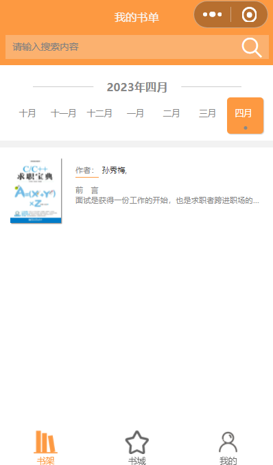

# ProgramBook

本项目就是一个基于微信小程序的面向程序员的书城，简称微书，这里是Java前端，用的是vue的uniapp，后端在这 https://github.com/qq13456116532/ProgramBook

## 运行界面： 

搜索：

## 安装

HbuilderX，微信开发者工具，然后把 /utils/api/api.js中的HOST_URL的IP改成你自己的即可

## 使用

用HbuilderX运行到小程序即可

## 贡献

本人

## 许可

GPL

